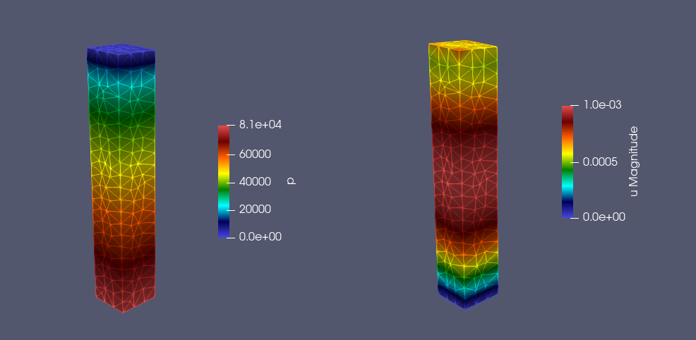
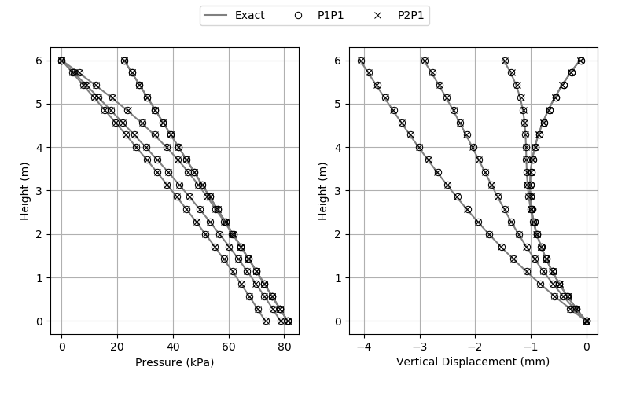

# Geomec3D/GravityColumn3D

Solution of the coupled fluid flow and geomechanics problem in a poroelastic column immersed in a gravitational field.

## Numerical Solution

The numerical solution is obtained using P1P1 and P2P1 formulations and verified against the analytical solution.

#### Pore Pressure and Displacement Fields:

	

#### Verification:

	

