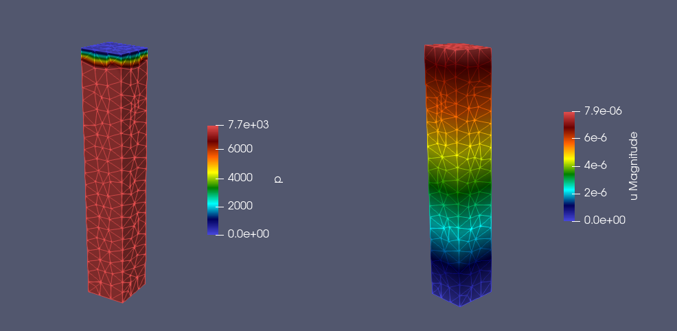
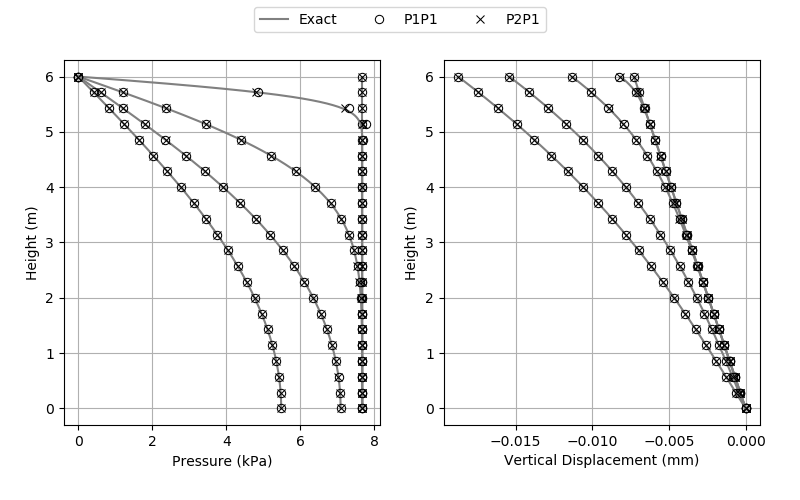

# Geomec3D/Terzaghi3D

Solution of the coupled fluid flow and geomechanics problem in a poroelastic column.

## Numerical Solution

The numerical solution is obtained using P1P1 and P2P1 formulations and verified against the analytical solution provided by K. Terzaghi (1923,1925).

#### Pore Pressure and Displacement Fields:

	

#### Verification:

	

